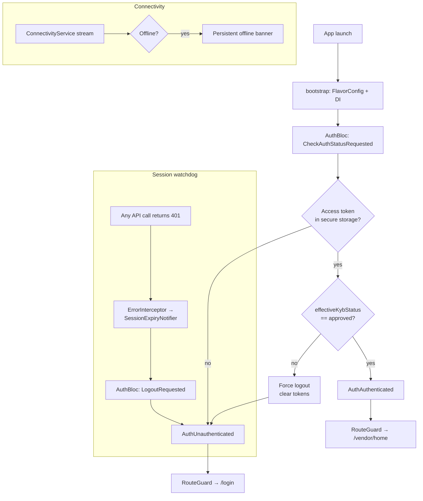
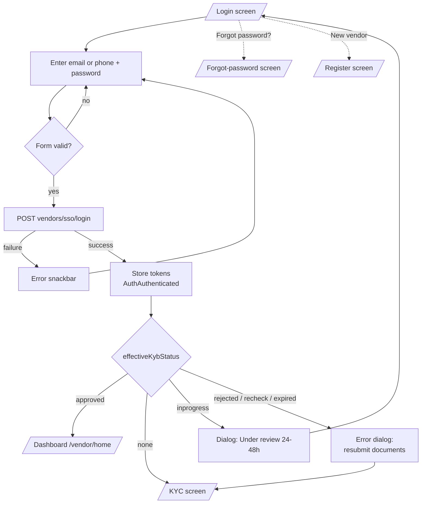
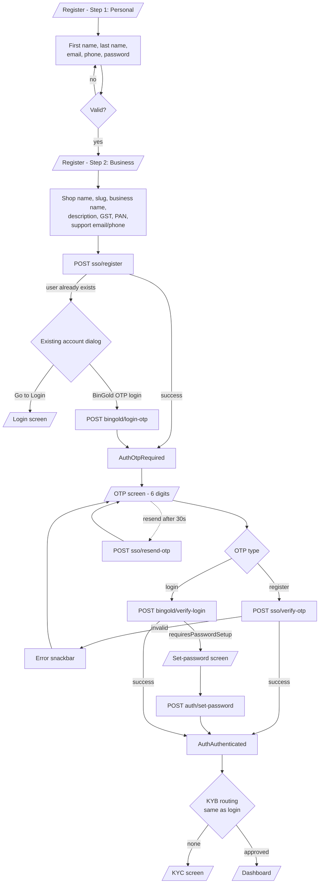
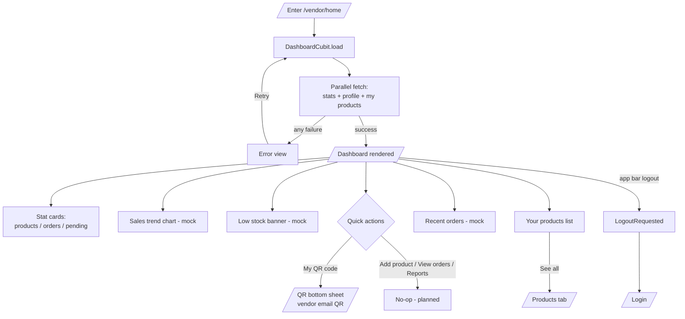
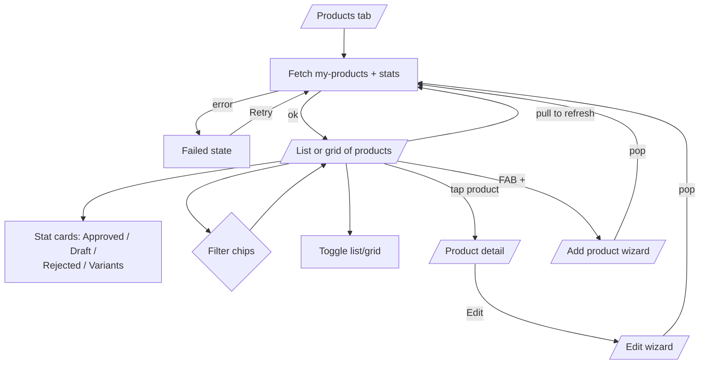
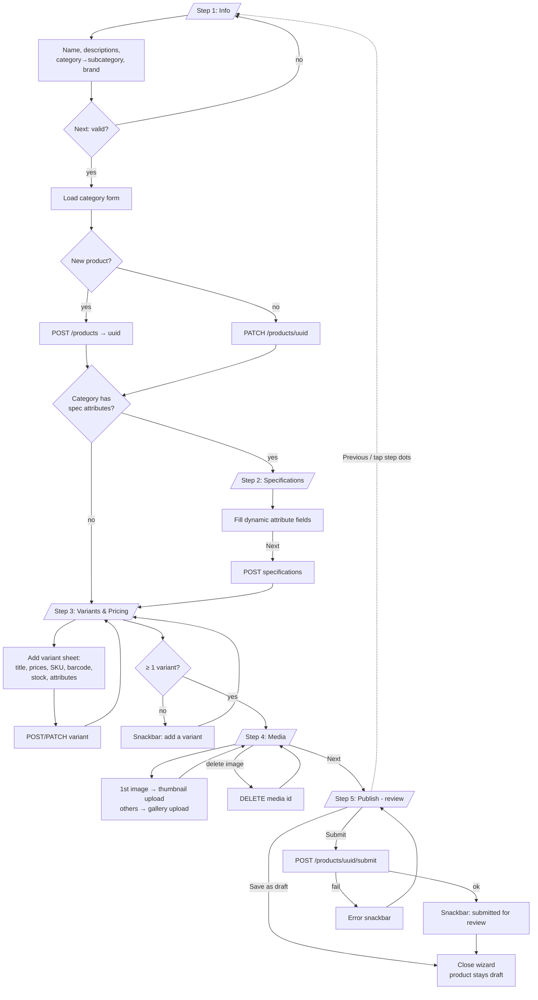
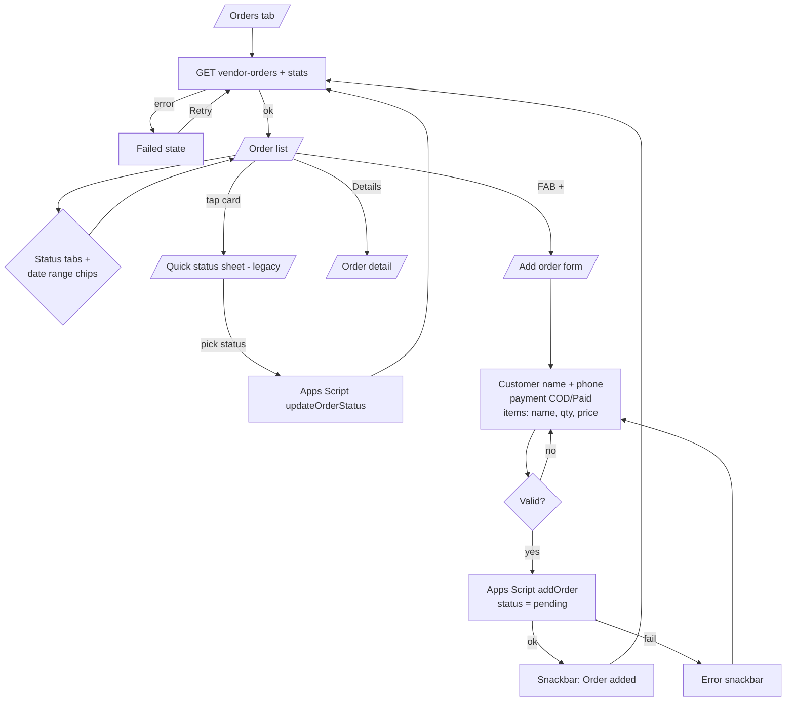
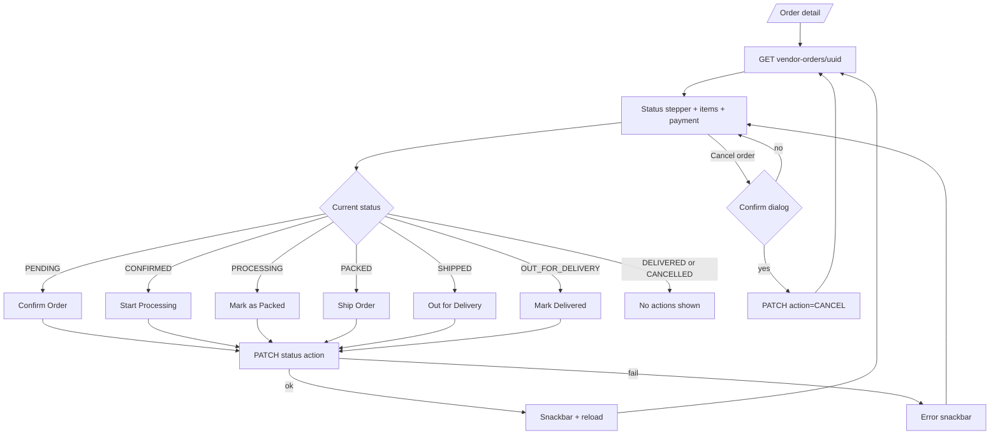
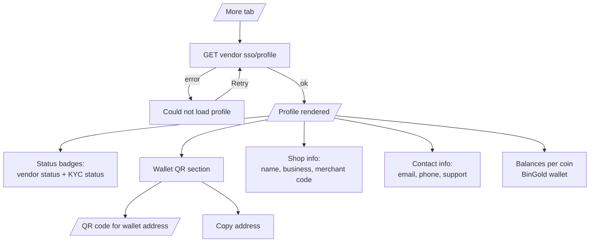
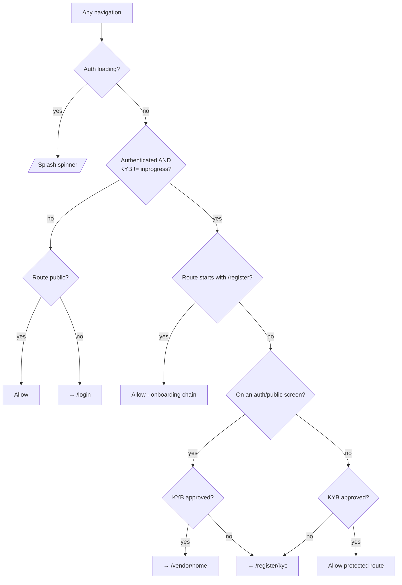

# Software Requirements Specification (SRS)

## Bingo Pay — Multi-Vendor Marketplace (Vendor App)

| | |
|---|---|
| **Document version** | 1.0 |
| **Date** | 2026-07-07 |
| **Platform** | Flutter (Android / iOS), Dart SDK ^3.10.8 |
| **App version** | 1.0.0+1 |
| **Source branch** | `development-vendor` |

---

## Table of Contents

1. [Introduction](#1-introduction)
2. [Overall Description](#2-overall-description)
3. [System Architecture](#3-system-architecture)
4. [Module Specifications & Functional Requirements](#4-module-specifications--functional-requirements)
   - 4.1 [Authentication & Onboarding](#41-module-authentication--onboarding)
   - 4.2 [KYC / KYB Verification](#42-module-kyc--kyb-verification)
   - 4.3 [Dashboard (Home)](#43-module-dashboard-home)
   - 4.4 [Products](#44-module-products)
   - 4.5 [Orders / Transactions](#45-module-orders--transactions)
   - 4.6 [More (Profile & Wallet)](#46-module-more-profile--wallet)
   - 4.7 [Navigation Shell & Route Guard](#47-module-navigation-shell--route-guard)
5. [External Interface Requirements (API)](#5-external-interface-requirements-api)
6. [Data Model](#6-data-model)
7. [Non-Functional Requirements](#7-non-functional-requirements)
8. [Known Gaps / Incomplete Features](#8-known-gaps--incomplete-features)

---

## 1. Introduction

### 1.1 Purpose

This document specifies the software requirements for **Bingo Pay**, a mobile application that lets **vendors** of a multi-vendor marketplace register their shop, complete identity (KYC/KYB) verification, manage a product catalog (with variants, media and specifications), receive and fulfil customer orders, and view their business profile, crypto-wallet balances and payment QR code.

The document is reverse-engineered from the current codebase and reflects the behaviour actually implemented (including mock/placeholder areas, which are called out explicitly in §8).

### 1.2 Scope

The app is the **vendor-facing** client only (a previous customer flow has been removed — see git history "removed customer"). It communicates with:

- The **Bingo backend REST API** (`/api/v1/...`) for auth, vendor profile, KYC, products, orders and dashboard statistics.
- A legacy **Google Apps Script** endpoint used by a few older order/product calls.
- **Cloudinary** (proxied through the backend `/api/v1/uploads` endpoint) for KYC document storage.

### 1.3 Definitions & Abbreviations

| Term | Meaning |
|---|---|
| **KYC** | Know Your Customer — document-level identity verification of the vendor |
| **KYB** | Know Your Business — overall business verification status returned by the backend (`none / inprogress / approved / rejected / recheck / expired`) |
| **BinGold** | Companion/parent platform account (`bingold` SSO). Existing BinGold users log in via OTP and may be asked to set a password |
| **SSO** | The backend's common vendor single-sign-on endpoints (`/api/v1/common/vendors/sso/...`) |
| **Vendor Shell** | The bottom-navigation container holding the four main tabs (Home, Products, Orders, More) |
| **Draft product** | A product created but not yet submitted for admin review |

### 1.4 Tech Stack (as implemented)

| Concern | Library |
|---|---|
| State management | `flutter_bloc` (BLoC + Cubit), `equatable` |
| Navigation | `go_router` (with `StatefulShellRoute` for tabs) |
| Dependency injection | `get_it` + `injectable` (code-gen) |
| Networking | `dio` + interceptors (auth, logging, error) |
| Storage | `flutter_secure_storage` (tokens), `shared_preferences` |
| Functional errors | `fpdart` (`Either<Failure, T>` in use cases) |
| Flavors | `flutter_flavor` (dev / staging / prod entrypoints) |
| Media | `image_picker`, `file_picker`, `cached_network_image` |
| Misc | `qr_flutter` (wallet QR), `fl_chart` (sales chart), `connectivity_plus` (offline banner), `encrypt`, `share_plus` |

---

## 2. Overall Description

### 2.1 User Class

There is a single user class: the **Vendor** (`role == 'vendor'`). A vendor's access level is further gated by KYB status — only `approved` vendors reach the main app; all other statuses are held at the KYC submission screen or bounced to login.

### 2.2 Operating Environment

- Flutter mobile app (Material Design, light + dark themes defined in `AppTheme`).
- Three build flavors, selected by entrypoint:
  - `main_dev.dart` → `http://13.159.7.199:5001`, logging on
  - `main_staging.dart`, `main_prod.dart` → analogous flavor configs
- All API requests carry a static `x-api-key` header plus a Bearer access token (added by `AuthInterceptor`).

### 2.3 High-Level Product Functions

1. Vendor registration (2-step form) with email OTP verification.
2. Login with email/phone + password; BinGold users can OTP-login and set a password.
3. KYC document upload and submission; KYB-status-driven routing.
4. Dashboard with business stats, quick actions and product overview.
5. Product catalog CRUD via a multi-step wizard (info → specifications → variants/pricing → media → publish), with draft/submit-for-review lifecycle.
6. Order management: list, filter, detail view with a strict forward-only fulfilment pipeline, plus manual (offline) order entry.
7. Profile: shop & contact info, KYC/status badges, crypto wallet addresses with QR, coin balances.
8. Session management: token persistence, automatic logout on session expiry (401), offline connectivity banner.

---

## 3. System Architecture

Clean-architecture-flavored layering per feature:

```
lib/
├── app/                    # App widget, bootstrap, BlocListener → router auth sync
├── core/
│   ├── api/                # ApiClient (dio), AppsScriptClient, endpoints, interceptors,
│   │   │                     SessionExpiryNotifier
│   ├── config/             # AppConfig (flavor vars), AppConstants (storage keys)
│   ├── di/                 # get_it/injectable wiring
│   ├── router/             # AppRouter (GoRouter), AppRoutes, RouteGuard
│   ├── storage/            # SecureStorageService
│   ├── network/            # ConnectivityService
│   ├── security/ theme/ utils/ widgets/ helpers/
└── features/
    ├── auth/               # data / domain / presentation (BLoC) — login, register, OTP, KYC
    ├── dashboard/          # DashboardCubit + home screen + VendorShell
    ├── products/           # datasource + product list / wizard / detail screens
    ├── transactions/       # order datasource + list / detail / add-order screens
    └── more/               # profile datasource + More screen
```

**State/data flow (auth example):**
`Screen → AuthBloc (event) → UseCase → Repository → RemoteDataSource → Dio → API`, results returned as `Either<Failure, Entity>`; `App`'s `BlocListener` mirrors `AuthAuthenticated / AuthUnauthenticated` into `AppRouter.updateAuthState()`, which re-runs `RouteGuard.redirect`.

The newer modules (dashboard, products, transactions, more) intentionally skip the use-case layer and call data sources / `ApiClient` directly from cubits and `FutureBuilder`-based screens.

### 3.1 Global App / Session Flow



---

## 4. Module Specifications & Functional Requirements

---

### 4.1 Module: Authentication & Onboarding

**Screens:** `LoginScreen`, `RegisterScreen` (2 steps), `OtpVerificationScreen`, `SetPasswordScreen`, `ForgotPasswordScreen`
**State:** `AuthBloc` (events → states listed below)
**Routes:** `/login`, `/register`, `/register/otp`, `/register/set-password`, `/forgot-password`

#### 4.1.1 Functional Requirements

| ID | Requirement |
|---|---|
| AUTH-01 | The system shall let a vendor log in with an identifier (email or phone) and password via `POST /api/v1/common/vendors/sso/login`. |
| AUTH-02 | On successful login, the system shall persist access/refresh tokens in secure storage and route the vendor according to KYB status (see AUTH-10). |
| AUTH-03 | Registration shall be a two-step form: **Personal** (first name, last name, email, phone, password) then **Business** (shop name, shop slug, business name, optional description, GST number, PAN number, support email, support phone). |
| AUTH-04 | Submitting registration (`POST .../sso/register`) shall trigger an email OTP and navigate to the OTP screen (`AuthOtpRequired`). |
| AUTH-05 | The OTP screen shall accept a 6-digit code, disable resend for a 30-second cooldown, and support resend (`POST .../sso/resend-otp`). |
| AUTH-06 | The OTP screen shall serve three purposes via `OtpScreenArgs.otpType`: `register` (verify-otp → authenticated), `login` (BinGold verify-login), `forgotPassword` (**not yet implemented**). |
| AUTH-07 | If registration detects an existing BinGold user, the system shall offer a login-OTP flow (`POST /api/v1/auth/bingold/login-otp` → `verify-login`). If `verify-login` responds `requiresPasswordSetup`, the vendor shall be taken to `SetPasswordScreen` (`POST /api/v1/auth/set-password`), after which they are authenticated. |
| AUTH-08 | The register screen shall show an "account already exists" dialog with a **Go to Login** action. |
| AUTH-09 | Forgot password: the screen collects an email and currently emits a mocked `PasswordResetSent` state (no API call). |
| AUTH-10 | After any successful authentication, `handlePostAuthKybNavigation` shall route by `effectiveKybStatus`: `approved` → dashboard; `none` → KYC screen; `inprogress` → info dialog ("24–48 hours") then back to login; `rejected` / `recheck` / `expired` → error dialog then KYC screen for resubmission. |
| AUTH-11 | On app restart, a stored session shall only be resumed for `approved` vendors; any other status is force-logged-out (`CheckAuthStatusRequested` handler). |
| AUTH-12 | Logout shall clear tokens and emit `AuthUnauthenticated`, which redirects to `/login`. |
| AUTH-13 | A 401 from any API call shall trigger automatic logout via `SessionExpiryNotifier`. |

#### 4.1.2 User Flow — Login



#### 4.1.3 User Flow — Registration & OTP



---

### 4.2 Module: KYC / KYB Verification

**Screens:** `KycScreen` (+ `KycDocumentUploadSheet`)
**Route:** `/register/kyc` (public route, reachable while authenticated)
**Backend:** uploads via `POST /api/v1/uploads` (Cloudinary), submission via `POST /api/v1/common/vendors/{uuid}/sso/kyc`

#### 4.2.1 Functional Requirements

| ID | Requirement |
|---|---|
| KYC-01 | The vendor shall upload one or more government-issued documents. Each upload opens a bottom sheet where the vendor picks a document type and a file (image or PDF). |
| KYC-02 | Files shall be uploaded immediately to Cloudinary through the backend uploads endpoint; the sheet returns `{documentType, documentUrl, publicId, fileName}`. |
| KYC-03 | The vendor shall be able to delete an added document before submission (deletes the Cloudinary asset by `publicId`, with per-row loading state). |
| KYC-04 | Submission shall require at least one document; otherwise an error snackbar is shown. |
| KYC-05 | On submit, the document list shall be sent to the vendor KYC endpoint; success shows a blocking "Document Submitted" dialog whose only action logs the vendor out and returns to login (review takes 24–48 h). |
| KYC-06 | While KYB review is `inprogress`, the route guard shall treat the vendor as blocked (equivalent to logged-out) — they cannot reach any vendor route. |
| KYC-07 | A non-approved authenticated vendor deep-linking to any protected route shall be bounced to the KYC screen. |
| KYC-08 | `effectiveKybStatus` shall prefer a *final* document-verification outcome (approved/rejected/recheck/expired from `kycStatus`) over a stale `kybStatus` (e.g. still `inprogress` right after a rejection). |

#### 4.2.2 User Flow — KYC Submission & Status Lifecycle

```mermaid
flowchart TD
    A[/KYC screen — Identity Verification/] --> B[Tap Upload Document]
    B --> C[/Bottom sheet:\nchoose type + pick file/]
    C --> D[POST /api/v1/uploads → Cloudinary]
    D -- fail --> E[Error toast] --> A
    D -- ok --> F[Document tile added\nimage or PDF icon]
    F -->|add more| B
    F -->|delete| G[DELETE upload by publicId] --> A
    F --> H{Submit}
    H -- no documents --> I[Snackbar: upload at least one] --> A
    H -- ok --> J[POST vendors/uuid/sso/kyc]
    J -- failure --> K[Error snackbar] --> A
    J -- success --> L[Dialog: Submitted for review]
    L --> M[Go to Login → forced logout]
    M --> N[/Login screen/]

    subgraph Backend review outcome — seen at next login
        O{KYB status} -- approved --> P[/Dashboard/]
        O -- inprogress --> Q[Info dialog → stay logged out]
        O -- rejected / recheck / expired --> R[Error dialog → KYC screen\nresubmit documents]
    end
    N -.next login.-> O
```

---

### 4.3 Module: Dashboard (Home)

**Screens:** `DashboardScreen` (inside `VendorShell` tab 0)
**State:** `DashboardCubit` (`load()` on create)
**Route:** `/vendor/home`

#### 4.3.1 Functional Requirements

| ID | Requirement |
|---|---|
| DASH-01 | On open, the dashboard shall load in parallel: vendor dashboard stats (`GET /api/v1/vendors/dashboard`), vendor profile (`GET .../sso/profile`), and the vendor's products (`GET /api/v1/products/my-products`). |
| DASH-02 | The app bar shall greet the vendor by shop name, show an avatar initial, a notifications bell (**no-op**, badge hardcoded) and a logout action. |
| DASH-03 | Stat cards (horizontally scrollable) shall show Total Products, Total Orders and Pending Orders from the stats API. |
| DASH-04 | A sales trend chart shall be displayed (**currently mock data** via `DashboardMockData.salesTrend`). |
| DASH-05 | A low-stock banner shall be displayed (**mock count**, Manage action no-op). |
| DASH-06 | Quick actions row: Add product (**no-op**), View orders (**no-op**), My QR code (opens email-QR bottom sheet for the logged-in vendor), Reports (**no-op**). |
| DASH-07 | A Recent Orders section shall be displayed (**mock data**, See-all no-op). |
| DASH-08 | "Your Products" shall list real products from the API with a **See all** link to the Products tab. |
| DASH-09 | Loading shall show a spinner; failure shall show an error message with a **Retry** button re-invoking `load()`. |

#### 4.3.2 User Flow — Dashboard



---

### 4.4 Module: Products

**Screens:** `ProductsScreen` (tab 1), `AddProductScreen` (create & edit wizard), `ProductDetailScreen`
**Routes:** `/vendor/products`, `/vendor/products/create`, `/vendor/products/:id`, `/vendor/products/:id/edit`
**Data:** `ProductRemoteDataSource` (full REST implementation; one legacy Apps Script `addProduct` remains)

#### 4.4.1 Functional Requirements — Product List

| ID | Requirement |
|---|---|
| PRD-01 | The list shall fetch the vendor's products (`GET /api/v1/products/my-products`) and dashboard stats to render stat cards: Approved, Draft, Rejected, Total Variants. |
| PRD-02 | The vendor shall filter products with chips (All / status-based via `ProductFilter`) and toggle list ⇄ grid view. |
| PRD-03 | Pull-to-refresh shall re-fetch products and stats; errors show a retry state; empty results show "No products found". |
| PRD-04 | A FAB shall open the Add Product wizard; on return, the list refreshes. |
| PRD-05 | Search and filter icons in the app bar are **no-ops** (planned). |

#### 4.4.2 Functional Requirements — Add / Edit Product Wizard

| ID | Requirement |
|---|---|
| PRD-10 | The wizard shall have up to 5 steps — **Info, Spec, Variant, Media, Publish** — with a tappable step indicator. The **Spec** step is shown only if the selected category's form (`GET /api/v1/products/category/{uuid}/form`) defines specification attributes. |
| PRD-11 | **Info step:** name, short description, full description, category → subcategory (from `GET /api/v1/categories/tree`, root-level filtered), optional brand (from `GET /api/v1/brands`). |
| PRD-12 | Leaving the Info step shall create the product (`POST /api/v1/products`) on first pass, or patch it (`PATCH /api/v1/products/{uuid}`) when editing — the wizard is **server-backed step-by-step**, not a single final submit. |
| PRD-13 | **Spec step:** dynamic fields from category form specification attributes; saved via `POST /api/v1/products/{uuid}/specifications` (empty values filtered out). |
| PRD-14 | **Variant step:** the vendor shall add at least one variant to proceed. Each variant has title, base/sale/cost price, SKU, barcode, stock, default flag, and attribute values from the category's variant attributes. Variants are saved individually (`POST/PATCH .../variants`) when the variant sheet is saved. |
| PRD-15 | **Media step:** first image uploads as thumbnail (`POST .../media/thumbnail`, replace supported), additional images as gallery (`POST .../media/gallery`); images can be deleted by media id; optional video link field. |
| PRD-16 | **Publish step:** review summary with two terminal actions — **Save as draft** (just closes; product already persisted) or **Submit** (`POST /api/v1/products/{uuid}/submit` → sends for admin review). |
| PRD-17 | **Edit mode** (`/vendor/products/:id/edit`) shall preload title/descriptions/brand/category (resolving root vs child category from the tree), media (primary first), variants, category form and existing specification values. |
| PRD-18 | Every step transition and upload shall surface failures as snackbars and keep the vendor on the current step. |

#### 4.4.3 Functional Requirements — Product Detail

| ID | Requirement |
|---|---|
| PRD-20 | The detail screen (`GET /api/v1/products/{uuid}`) shall show media, status, descriptions, category/brand, variants and specifications, with navigation to edit. |

#### 4.4.4 User Flow — Products List



#### 4.4.5 User Flow — Add / Edit Product Wizard



---

### 4.5 Module: Orders / Transactions

**Screens:** `TransactionScreen` (tab 2), `OrderDetailScreen`, `AddOrderScreen`
**Routes:** `/vendor/transactions`, `/vendor/transactions/:id`, `/vendor/orders/create`
**Data:** `OrderRemoteDataSource` — new vendor-orders REST API + legacy Apps Script (`addOrder`, `updateOrderStatus`, `getOrders`)

#### 4.5.1 Functional Requirements — Order List

| ID | Requirement |
|---|---|
| ORD-01 | The list shall fetch vendor orders (`GET /api/v1/vendor-orders`) and dashboard stats (Pending / Delivered stat cards). |
| ORD-02 | Orders shall be filterable by status tabs (Pending, Confirmed, Processing, Shipped, Delivered) and date range chips (Today / This week / This month / Custom — custom currently passes everything). |
| ORD-03 | Each order card shows order number, item summary ("first item +N more"), total amount, payment type (COD/Paid), status and relative time. |
| ORD-04 | Tapping the card body opens a **quick status sheet** that updates status via the **legacy Apps Script** `updateOrderStatus` call. |
| ORD-05 | A Details action (when the order has a UUID) opens the order detail screen; returning refreshes the list. |
| ORD-06 | Pull-to-refresh, error-with-retry, and empty states shall be provided. Search/filter app-bar icons are **no-ops**. |
| ORD-07 | A FAB opens the Add Order screen; the list refreshes on return. |

#### 4.5.2 Functional Requirements — Order Detail & Fulfilment Pipeline

| ID | Requirement |
|---|---|
| ORD-10 | Detail (`GET /api/v1/vendor-orders/{uuid}`) shall show status pill, payment method/status, items, amounts, cancellation notice (if cancelled) and a vertical **status stepper** with per-step timestamps. |
| ORD-11 | Status progression shall be strict and forward-only, mirroring the backend validation service: `PENDING → CONFIRMED → PROCESSING → PACKED → SHIPPED → OUT_FOR_DELIVERY → DELIVERED`. |
| ORD-12 | The primary button shall always offer only the *next* action: Confirm Order → Start Processing → Mark as Packed → Ship Order → Out for Delivery → Mark Delivered (`PATCH /api/v1/vendor-orders/{uuid}/status` with `{action}`). |
| ORD-13 | A **Cancel** action shall be available until the order is delivered and shall require a confirmation dialog. |
| ORD-14 | Orders in `CANCELLED` or `DELIVERED` state shall show no action buttons. |

#### 4.5.3 Functional Requirements — Add (Manual) Order

| ID | Requirement |
|---|---|
| ORD-20 | The vendor shall record an offline order with: customer name (required), 10-digit phone (required), payment type (COD / Paid), and 1..n line items (product name, qty > 0, price > 0). |
| ORD-21 | The total amount shall be computed live as Σ(qty × price) and displayed in ₹ (en_IN). |
| ORD-22 | Submission posts to the **legacy Apps Script** `addOrder` with status `pending`; success closes the screen and refreshes the list. |

#### 4.5.4 User Flow — Orders



#### 4.5.5 User Flow — Order Fulfilment Pipeline (Order Detail)



---

### 4.6 Module: More (Profile & Wallet)

**Screens:** `MoreScreen` (tab 3)
**Route:** `/vendor/more`
**Data:** `ProfileRemoteDataSource` → `GET /api/v1/common/vendors/{uuid}/sso/profile`

#### 4.6.1 Functional Requirements

| ID | Requirement |
|---|---|
| MORE-01 | The screen shall load the combined vendor + BinGold profile; failures show "Could not load profile" with Retry. |
| MORE-02 | Header shall show shop identity with status badges: vendor `status` and `KYC: <kycStatus>`. |
| MORE-03 | **Wallet QR Code** section: renders wallet address QR (via `qr_flutter`) so customers can scan to pay, with copy-address support. |
| MORE-04 | **Shop** section: shop name, business name, merchant code. |
| MORE-05 | **Contact** section: email, phone, support email, support phone (rows hidden when null). |
| MORE-06 | **Balances** section: per-coin balances (coin, full name, icon, address, balance, total balance) from the BinGold wallet. |

#### 4.6.2 User Flow — More / Profile



---

### 4.7 Module: Navigation Shell & Route Guard

**Components:** `VendorShell` (BottomNavigationBar over `StatefulShellRoute.indexedStack`), `RouteGuard`, `AppRouter`

#### 4.7.1 Functional Requirements

| ID | Requirement |
|---|---|
| NAV-01 | The vendor area shall use a 4-tab bottom bar — Home, Products, Orders (with badge — **currently hardcoded "12"**), More — each tab keeping its own navigation stack. |
| NAV-02 | Re-tapping the active tab shall reset that tab to its root route. |
| NAV-03 | Full-screen flows (add/edit product, product detail, add order, order detail, invoices) shall be pushed **outside** the shell (no bottom bar). |
| NAV-04 | While auth state is loading, all routes shall redirect to `/splash` (spinner). |
| NAV-05 | Unauthenticated users may access only public routes (`/splash`, `/login`, `/register`, `/register/otp`, `/register/set-password`, `/register/kyc`, `/forgot-password`); everything else redirects to `/login`. |
| NAV-06 | Authenticated + KYB `inprogress` shall be treated as blocked (same as logged out). |
| NAV-07 | Authenticated non-approved vendors shall be redirected to `/register/kyc` from any protected route; approved vendors landing on auth screens shall be bounced to `/vendor/home`. |
| NAV-08 | The `/register/...` onboarding chain shall remain reachable immediately after authentication so OTP/KYC screens can navigate explicitly. |
| NAV-09 | `/vendor/invoices` and `/vendor/invoices/:id` are registered but render **placeholder pages**. |

#### 4.7.2 Flow — Route Guard Decision



---

## 5. External Interface Requirements (API)

Base URL per flavor (`AppConfig.apiBaseUrl`); headers: `Content-Type/Accept: application/json`, `x-api-key: <flavor key>`, `Authorization: Bearer <token>` (via `AuthInterceptor`). Timeouts from `AppConfig`. List responses may be double-wrapped (`{data:{data:[...]}}`) and are defensively unwrapped.

### 5.1 Auth & Vendor SSO

| Method | Endpoint | Use |
|---|---|---|
| POST | `/api/v1/common/vendors/sso/register` | Vendor registration → OTP |
| POST | `/api/v1/common/vendors/sso/verify-otp` | Verify registration OTP |
| POST | `/api/v1/common/vendors/sso/resend-otp` | Resend OTP |
| GET/POST | `/api/v1/common/vendors/sso/user-exists` | Check existing account (email) |
| POST | `/api/v1/common/vendors/sso/login` | Password login |
| POST | `/api/v1/auth/bingold/login-otp` | BinGold OTP request |
| POST | `/api/v1/auth/bingold/verify-login` | BinGold OTP verify (may require password setup) |
| POST | `/api/v1/auth/set-password` | Set password after BinGold login |
| GET | `/api/v1/common/vendors/{uuid}/sso/profile` | Vendor + BinGold profile |
| POST | `/api/v1/common/vendors/{uuid}/sso/kyc` | Submit KYC documents |
| POST/DELETE | `/api/v1/uploads` | Cloudinary upload / delete (KYC docs) |
| — | `/auth/refresh`, `/auth/forgot-password`, `/kyc/status`, `/auth/me` | Declared, not (fully) wired |

### 5.2 Catalog & Products

| Method | Endpoint | Use |
|---|---|---|
| POST | `/api/v1/products` | Create product (Info step) |
| GET | `/api/v1/products/my-products` | Vendor's products |
| GET/PATCH | `/api/v1/products/{uuid}` | Detail / step patches |
| GET | `/api/v1/categories`, `/api/v1/categories/tree` | Categories (tree filtered to roots) |
| GET | `/api/v1/brands` | Brands |
| GET | `/api/v1/category-attributes`, `/api/v1/attribute-options` | Attribute metadata |
| GET | `/api/v1/products/category/{uuid}/form` | Dynamic spec + variant attribute form |
| GET/POST | `/api/v1/products/{uuid}/specifications` | Specifications |
| GET/POST/PATCH | `/api/v1/products/{uuid}/variants`, `/api/v1/variants/{uuid}` | Variants |
| GET | `/api/v1/products/{uuid}/media` | All media |
| POST | `.../media/thumbnail`, `.../media/thumbnail/replace`, `.../media/gallery` | Multipart image uploads |
| DELETE | `/api/v1/products/media/{id}` | Delete media |
| POST | `/api/v1/products/{uuid}/submit` | Submit for review |

### 5.3 Orders & Dashboard

| Method | Endpoint | Use |
|---|---|---|
| GET | `/api/v1/vendors/dashboard` | Stats (products/orders counters) |
| GET | `/api/v1/vendor-orders` | Order list |
| GET | `/api/v1/vendor-orders/{uuid}` | Order detail |
| PATCH | `/api/v1/vendor-orders/{uuid}/status` | `{action: CONFIRM/PROCESS/PACK/SHIP/OUT_FOR_DELIVERY/DELIVER/CANCEL}` |
| Apps Script | `addOrder`, `updateOrderStatus`, `getOrders`, `addProduct` | Legacy manual-order path |

---

## 6. Data Model

Key client-side entities/models:

- **UserEntity** — `id, email, name, role('vendor'), kycStatus, kybStatus, shopName, merchantCode, businessName`; computed `effectiveKybStatus` (document outcome wins over stale KYB), `isKycApproved`, `isKycPending`.
- **KybStatus enum** — `none, inProgress, approved, rejected, recheck, expired` (mirrors backend Prisma enum).
- **KycEntity / KycDocumentSubmission** — `status`; `{documentType, documentUrl, publicId}`.
- **VendorProfileModel** — `vendor` (uuid, shopName, slug, status, verificationStatus, kybStatus, businessName, merchantCode, contact/support fields, GST, PAN) + `bingold` (bingoldUuid, kycStatus, status, walletAddresses{}, balances[]).
- **BalanceModel** — coin, address, balance, fullName, iconUrl, totalBalance.
- **DashboardStatsModel** — totalProducts, approvedProducts, draftProducts, rejectedProducts, totalVariants, totalOrders, pendingOrders, deliveredOrders.
- **ProductDraft / VariantDraft** — wizard working state: category/subcategory UUIDs, brand, featured flag, imagePaths + imageMediaIds, specifications map (attributeUuid → value), variants (title, basePrice, salePrice, costPrice, sku, barcode, stock, isDefault, attributeValues).
- **Order / OrderItem** — uuid, orderId, customerName/phone, items, totalAmount, payment (cod/paid), status, createdAt; adapters from both the legacy sheet shape and `VendorOrderModel`.
- **VendorOrderModel / VendorOrderDetailModel** — order number, items (productTitle, quantity, unitPrice), amounts, orderStatus, paymentMethod/paymentStatus, per-status timestamps.
- **Secure storage keys** — access/refresh token, userId, bingoldUuid, vendorUuid, temp tokens (`AppConstants`).

---

## 7. Non-Functional Requirements

| ID | Requirement |
|---|---|
| NFR-01 | **Security:** tokens in `flutter_secure_storage`; every request authenticated via Bearer token + static API key; 401 triggers global forced logout. |
| NFR-02 | **Session policy:** persistent sessions only for KYB-approved vendors; all others must re-authenticate on app restart. |
| NFR-03 | **Resilience:** API list/object responses defensively unwrapped; per-screen error + retry states; failures never crash flows (snackbars). |
| NFR-04 | **Offline awareness:** connectivity stream shows a persistent offline banner. |
| NFR-05 | **Performance:** dashboard fires its three requests in parallel; images cached (`cached_network_image`); tab stacks preserved via indexed stack. |
| NFR-06 | **Environments:** dev/staging/prod flavors with separate base URLs, API keys and logging flags; pretty request logging in dev. |
| NFR-07 | **UX consistency:** central theme (light + dark), shared widgets (AppButton, AppTextField, AppImagePicker, StepIndicator, snackbars/dialog helpers), INR currency formatting (en_IN). |
| NFR-08 | **Localization readiness:** `intl` + `generate: true` configured; UI strings currently hardcoded English. |
| NFR-09 | **Testing:** `bloc_test`/`mocktail` are configured as dev dependencies (tests are written by the team, not auto-generated). |

---

## 8. Known Gaps / Incomplete Features

Implemented-as-placeholder or intentionally pending items found in code:

| Area | Gap |
|---|---|
| Forgot password | UI only; bloc emits mock `PasswordResetSent`, no API call; forgot-password OTP verify is a TODO |
| Dashboard | Sales trend chart, low-stock banner and recent orders use mock data; notifications, Add product / View orders / Reports quick actions and See-all are no-ops |
| Orders tab badge | Hardcoded "12" in `VendorShell` |
| Search / filters | App-bar search & filter icons on Products and Orders are no-ops; "Custom" date range applies no filtering |
| Invoices | `/vendor/invoices(/:id)` routes render placeholder pages |
| Legacy path | Manual add-order, quick status sheet update and one `addProduct` still go through the Google Apps Script client; the detail-screen pipeline uses the new vendor-orders API |
| KYC polling | `KycStatusPolled` emits a hardcoded `under_review` state (no `/kyc/status` call) |
| Declared-unused endpoints | `/auth/refresh`, `/auth/me`, `/kyc/status`, `/transactions`, `/invoices`, `/referral` are declared in `ApiEndpoints` but not wired |

---

*End of document.*
